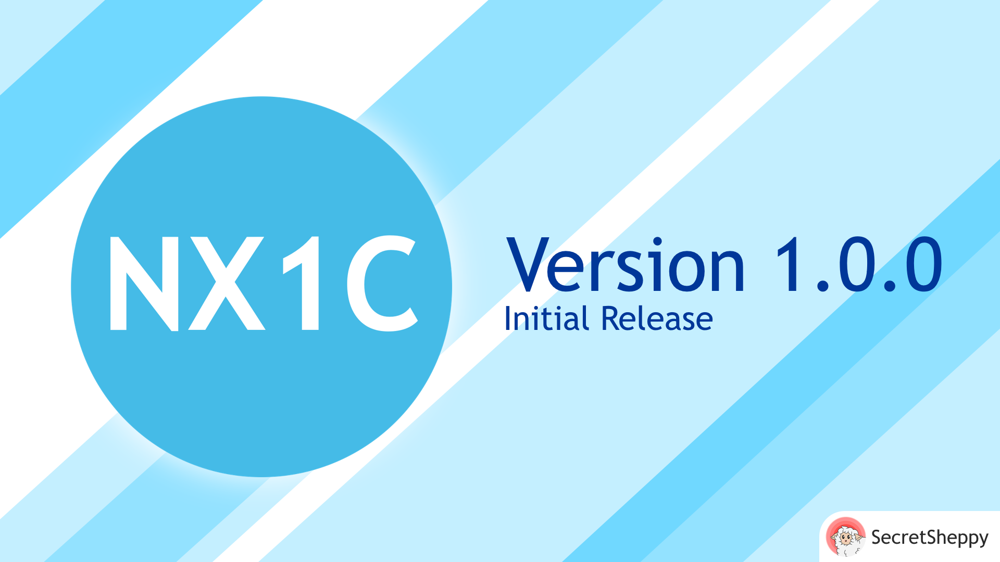
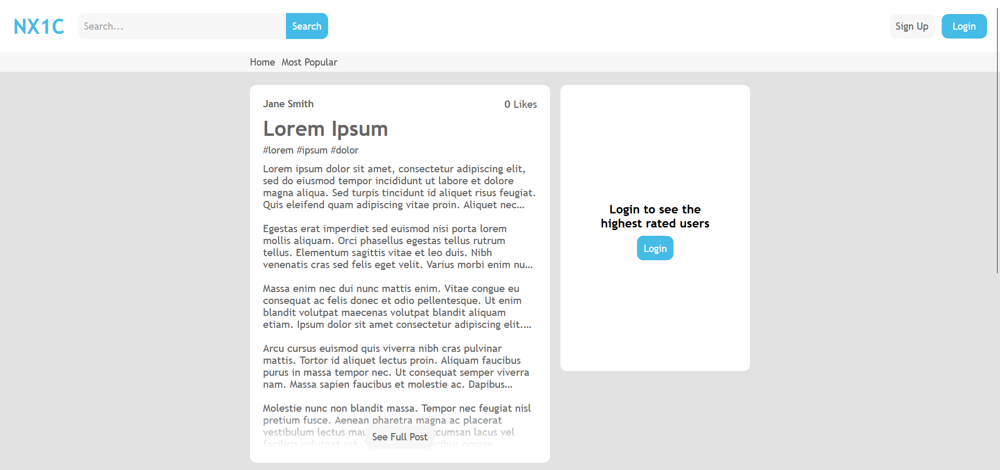

NX1C is a pure php service that can be used and configured in a variety of ways.
Its primary use is that of a reddit like social media
service however it can easily be repurposed as a forum, blog or general website.

NX1C was designed as a privacy centric service and was initially built without Javascript
(hence being built in only php). Due to this NX1C is incredibly fast and reliable.
By default, NX1C does not collect any personal information like
emails and instead uses a 40 character long security token that users must use in order to alter
their username and or password or delete their account. This can be changed by the host, however
if a host decides to collect personal information like emails they must then encrypt all the data
in their database (NX1C does not provide the ability to do this).

NX1C can be used as a forum or blog however this will require some extensive modifications.
Anyone attempting this should be well versed in html and php.

## A look at the interface
The NX1C interface is designed to be clean and simple, so as one might imagine it is not the most
exciting interface to ever exist. However, it can be fully customised using the CSS variables in the 
root of `./resources/css/main.light.css` or a host can write their own css theme entirely from scratch.

By default, the NX1C interface uses the NX1C light theme, but it does also come with a dark theme that can
be enabled by a user in their account settings.

## Installation
Installing NX1C is a simple process, if you encounter any errors whilst following the steps below
either create an issue or a new discussion, and I'll get back to you within a few days.
### Prerequisites
* Apache Server
* MySQL Server
### Installation Steps
1. Clone the `nx1c-main` repository into the `htdocs` or `public html` folder of your apache install
2. Open phpmyadmin (or your equivalent database manager)
3. Run `./protected/sql/nx1c_database_config.sql` in the console
4. Open `./about/nx1c.xml` and enter the settings you want
5. You're all done!
### Optional Steps
1. Clone the `nx1c-control-panel` repository into the `htdocs` or `public html` folder of your apache install
2. Open phpmyadmin (or your equivalent database manager)
3. Navigate to the `Users` table
4. In your account record add `admin` into the `UserRole` column
5. Open `https://your.domain.name/control-panel/` to login
6. You're all done!

## Roadmap
I have lots of plans for NX1C further down the line, here's a little insight into what's coming:

### Version 1.1.0
* Stacked Replies
* PDO Database Connection
* Deprecating SQLGen.php in favour of prepared SQL statements

### Version 1.2.0
* User Profiles

### Version 1.3.0
* NX1C Panels
