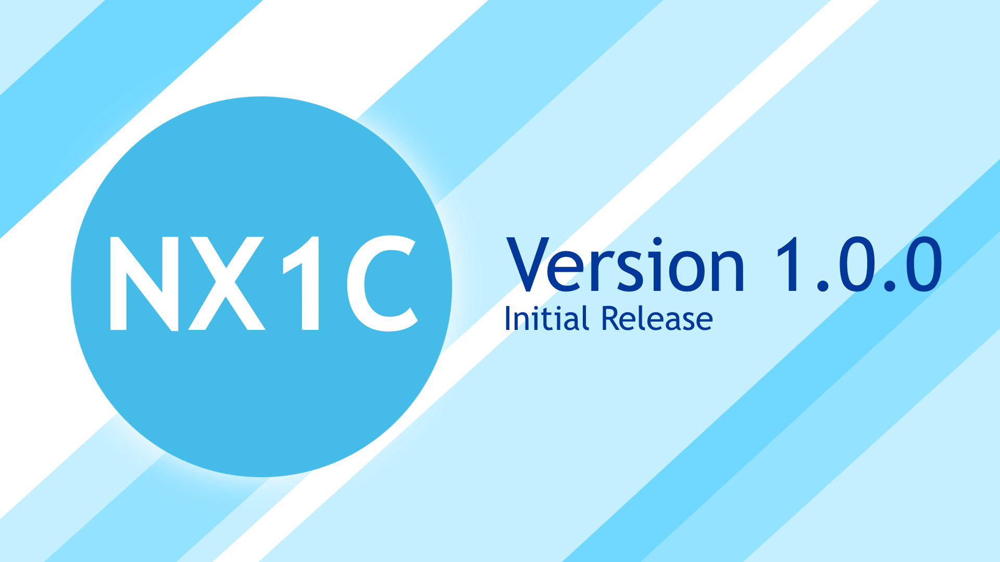

NX1C is a pure php service that can be used and configured in a variety of ways.
Its primary use is that of a reddit like social media
service however it can easily be repurposed as a forum, blog or general website.

NX1C was designed as a privacy centric service and was initially built without Javascript
(hence being built in only php). Due to this NX1C is incredibly fast and reliable.
By default, NX1C does not collect any personal information like
emails and instead uses a 40 character long security token that users must use in order to alter
their username and or password or delete their account. This can be changed by the host, however
if a host decides to collect personal information like emails they must then encrypt all the data
in their database (NX1C does not provide the ability to do this).

## Roadmap

