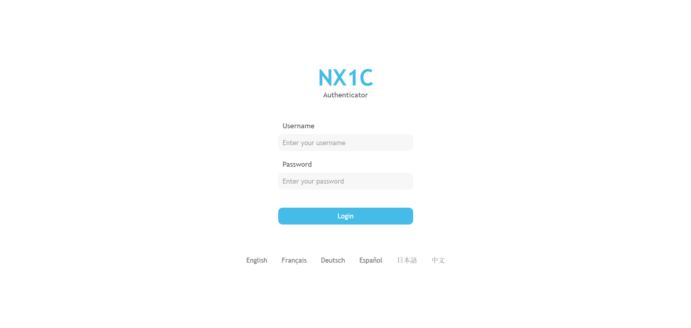

# NX1C Authenticator

NX1C Authenticator is a process for by device product activation/authorisation. It can also be used as an alternative to anti-pirating software

## The Interface

The NX1C Authenticator interface (seen below) is simple and easy to use. It can be easily modified to include branding for any projects that require it.

The interface supports six different languages
* English (default)
* French
* German
* Spanish
* Japanese
* Chinese (Simplified)

## The Backend

NX1C Authenticator uses mysqli to access MySQL databases.

## Installation and Use
